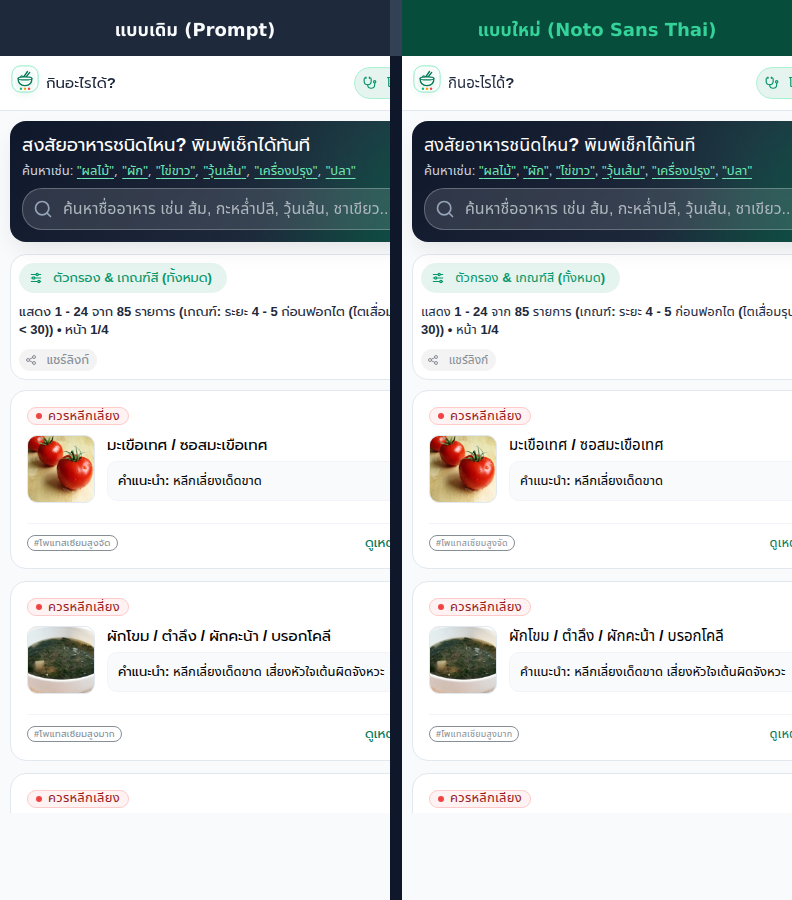
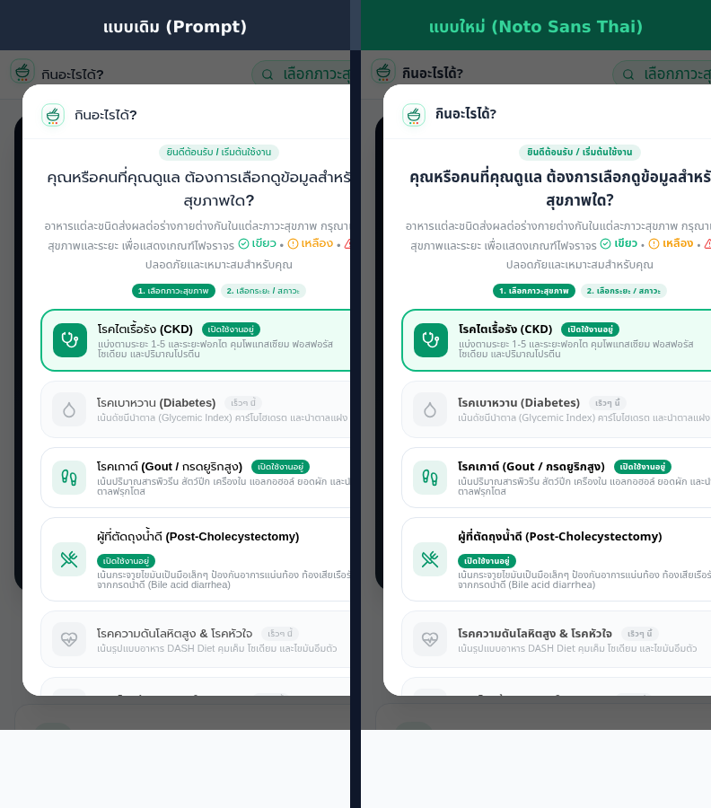

# ADR 0001: เลือกใช้ Noto Sans Thai เป็นแบบอักษรหลักของระบบ

* **สถานะ (Status):** Accepted
* **วันที่ตัดสินใจ (Date):** 2026-09-12
* **ผู้มีส่วนร่วมในการตัดสินใจ (Deciders):** Core Maintainers
* **ไฟล์ที่เกี่ยวข้อง (Relevant Files):**
  - [`index.html`](../../index.html)
  - [`src/index.css`](../../src/index.css)
  - [`src/theme.ts`](../../src/theme.ts)
  - [`scripts/capture-comparison.ts`](../../scripts/capture-comparison.ts)

---

## บริบทและปัญหา (Context and Problem Statement)

เว็บแอปพลิเคชัน **"กินอะไรได้?" (Kin Arai Dai)** ให้บริการสืบค้นความปลอดภัยของอาหารตามภาวะสุขภาพ (โรคไตเรื้อรัง, โรคเกาต์, ผู้ตัดถุงน้ำดี) โดยมีลักษณะเฉพาะดังนี้:
1. **ผู้ใช้งานส่วนใหญ่ใช้งานผ่านสมาร์ตโฟน (Mobile First):** หน้าจอมีความกว้างจำกัด (Viewport 360–414px)
2. **ข้อมูลทางการแพทย์มีความหนาแน่นสูง (High Information Density):** ชื่ออาหารหลายชนิดรวมกันในรายการเดียว, คำอธิบายค่าไต (eGFR), คำเตือนสารอาหาร (โพแทสเซียม, ฟอสฟอรัส, กรดยูริก, ไขมัน)
3. **ปัญหาของฟอนต์เดิม (`Prompt`):**
   - Prompt เป็นฟอนต์สไตล์ Geometric Loop (มีหัวกลมเด่น) ซึ่งมีตัวอักษรค่อนข้างกว้าง (Wide Letterforms / Tracking)
   - เมื่อแสดงผลบนจอมือถือ ทำให้ข้อความตัดขึ้นบรรทัดใหม่เร็วเกินไป ส่งผลให้การ์ดอาหารและองค์ประกอบต่างๆ กินพื้นที่แนวตั้งมาก (Vertical Scrolling Fatigue)
   - ต้องการแบบอักษรที่อ่านง่ายบนหน้าจอขนาดเล็ก มีความกะทัดรัด และสื่อถึงภาพลักษณ์แอปพลิเคชันสุขภาพที่น่าเชื่อถือ

---

## ปัจจัยในการตัดสินใจ (Decision Drivers)

1. **ความอ่านง่ายบนหน้าจอมือถือ (Mobile Legibility):** สระและวรรณยุกต์ไทยต้องแยกชั้นชัดเจน ไม่จม ไม่ซ้อนทับ แม้ในขนาดตัวหนังสือเล็ก เช่น ป้ายกำกับ (Tags / Badges ขนาด ~13px)
2. **การประหยัดพื้นที่ในแนวนอน (Horizontal Density):** ลดการตัดบรรทัดที่ไม่จำเป็นของชื่ออาหารยาวและข้อความทางการแพทย์
3. **โทนและภาพลักษณ์ (Tone of Voice):** ต้องให้ความรู้สึกสะอาดตา ทันสมัย เป็นมืออาชีพ น่าเชื่อถือ (Modern Clinical Look)
4. **ความเข้ากันได้กับระบบเดิม (Backward Compatibility):** ต้องทำงานร่วมกับ Mantine UI v7 ได้อย่างราบรื่น

---

## ทางเลือกที่พิจารณา (Considered Options)

1. **Option 1: `Prompt` (ฟอนต์เดิม)** — Loop font (มีหัวกลมเด่น) จาก Google Fonts
2. **Option 2: `Noto Sans Thai` (ฟอนต์ที่นำเสนอ)** — Modern Loopless Sans-Serif font จาก Google Fonts

---

## มติการตัดสินใจ (Decision Outcome)

**เลือก Option 2: `Noto Sans Thai` เป็นแบบอักษรหลัก (Primary Font)** ของโปรเจกต์ Kin Arai Dai ทั้งในระดับ Base CSS และ Mantine Theme โดยยังคงเก็บ `Prompt` ไว้ใน Fallback List ก่อน System Fonts:

```css
font-family: 'Noto Sans Thai', 'Prompt', -apple-system, BlinkMacSystemFont, 'Segoe UI', Roboto, sans-serif;
```

### ผลลัพธ์เชิงบวก (Positive Consequences)
- **ประหยัดพื้นที่แนวนอนได้ชัดเจน:** ความกว้างของตัวอักษรและระยะเคาะ (Letter spacing) ของ Noto Sans Thai มีความกระชับกว่า Prompt ช่วยลดความสูงของการ์ดอาหารและกล่องค้นหาบนจอมือถือ
- **ความคมชัดสูงในทุกขนาด:** สระบน/สระล่าง และวรรณยุกต์ มีสัดส่วนที่สมดุล อ่านง่ายทั้งในระดับ Heading, Body และ Tag ขนาดเล็ก (`xs: 0.8125rem` / ~13px)
- **น้ำหนักตัวหนา (Font Weights) มีความคมชัด:** น้ำหนัก SemiBold (600) และ Bold (700) ไม่บวมทึบ ทำให้อ่านหัวข้อและสเตจของโรคไตได้ชัดเจน
- **สื่อถึงภาพลักษณ์สุขภาพและวิทยาการที่ทันสมัย:** ให้ความรู้สึกเรียบ คลีน และเป็นทางการ เหมาะกับแอปสุขภาพ

### ผลลัพธ์ที่ต้องระวัง / ข้อแลกเปลี่ยน (Trade-offs & Mitigations)
- ฟอนต์แบบไม่มีหัว (Loopless) อาจให้ความรู้สึกเป็นทางการขึ้นเมื่อเทียบกับฟอนต์มีหัวที่ให้ความเป็นกันเองมากกว่า
- **การบรรเทา (Mitigation):** ชดเชยด้วยโทนสีของแอป (Emerald / Teal) และไอคอนน่ารักเป็นมิตร ทำให้ภาพรวมยังคงเข้าถึงง่ายและเป็นมิตรกับผู้ใช้งานทุกวัย

---

## ข้อดีและข้อเสียของแต่ละทางเลือก (Pros and Cons of the Options)

### Option 1: Prompt
* *ข้อดี:* มีหัวกลม ให้ความรู้สึกอบอุ่น เป็นมิตร เป็นฟอนต์ไทยยอดนิยมในเว็บทั่วไป
* *ข้อเสีย:* อักขระค่อนข้างกว้าง กินพื้นที่แนวนอน ตัวหนาค่อนข้างทึบ ทำให้บนจอมือถือกล่องข้อความยาวและกินพื้นที่แนวตั้งมากเกินไป

### Option 2: Noto Sans Thai (เลือกใช้)
* *ข้อดี:* สัดส่วนตัวอักษรกะทัดรัด (Compact), ประหยัดพื้นที่บนจอมือถือได้ดี, สระและวรรณยุกต์ชัดเจนในทุกขนาด, เส้นสายโมเดิร์นคลีน
* *ข้อเสีย:* หากเปิดในระบบที่ไม่มี local font และเน็ตช้า อาจต้องรอ Google Fonts ดาวน์โหลดเล็กน้อย (แก้ไขด้วยการ preconnect CDN และเก็บ Prompt/System Font เป็น fallback)

---

## หลักฐานเปรียบเทียบเชิงประจักษ์ (Visual Evidence)

เปรียบเทียบหน้าจอจริงบน Mobile Viewport (390 × 844 px) ระหว่างแบบเดิม (Prompt) และแบบใหม่ (Noto Sans Thai):

### 1. หน้าค้นหาและรายการอาหาร (Catalog & Search View)


* **ช่องค้นหา & ชิปหมวดหมู่:** Noto Sans Thai แสดงผลคำค้นหาและชิปตัวกรองได้อย่างกะทัดรัด ไม่ล้นขอบ
* **การ์ดอาหาร:** ชื่ออาหารยาว เช่น *"ผักโขม / ตำลึง / ผักคะน้า / บรอกโคลี"* มีความกระชับ อ่านสบายตา และลดการขึ้นบรรทัดใหม่

### 2. หน้าต่างเลือกภาวะสุขภาพ (Selection Dialog / Modal)


* **ความชัดเจนของชื่อโรคและระยะ:** การแสดงผลตัวหนาคมชัด รายละเอียดค่าไต (eGFR) และคำอธิบายแยกแยะได้ง่ายในพื้นที่จำกัด

---

## การนำไปปรับใช้ในโค้ด (Implementation Details)

### 1. โหลดแบบอักษรใน [`index.html`](../../index.html)
```html
<link rel="preconnect" href="https://fonts.googleapis.com">
<link rel="preconnect" href="https://fonts.gstatic.com" crossorigin>
<link href="https://fonts.googleapis.com/css2?family=Noto+Sans+Thai:wght@300;400;500;600;700&family=Prompt:wght@300;400;500;600;700&display=swap" rel="stylesheet">
```

### 2. กำหนด Base Font ใน [`src/index.css`](../../src/index.css)
```css
:root {
  font-family: 'Noto Sans Thai', 'Prompt', -apple-system, BlinkMacSystemFont, 'Segoe UI', Roboto, sans-serif;
  line-height: 1.5;
  font-weight: 400;
  color: #1e293b;
  background-color: #f8fafc;
  text-rendering: optimizeLegibility;
  -webkit-font-smoothing: antialiased;
}
```

### 3. กำหนด Theme ใน [`src/theme.ts`](../../src/theme.ts)
```ts
export const theme = createTheme({
  fontFamily: "'Noto Sans Thai', 'Prompt', -apple-system, BlinkMacSystemFont, 'Segoe UI', Roboto, sans-serif",
  headings: {
    fontFamily: "'Noto Sans Thai', 'Prompt', -apple-system, BlinkMacSystemFont, 'Segoe UI', Roboto, sans-serif",
    fontWeight: '700',
  },
  fontSizes: {
    xs: '0.8125rem', // ~13px
    sm: '0.9375rem', // ~15px
    md: '1.0625rem', // ~17px
    lg: '1.1875rem', // ~19px
    xl: '1.375rem',  // ~22px
  },
});
```

---

## เครื่องมือสนับสนุนการตัดสินใจ (Automation & Tooling)

เพื่อสนับสนุนการตัดสินใจเชิงประจักษ์ โปรเจกต์ได้พัฒนาสคริปต์อัตโนมัติ [`scripts/capture-comparison.ts`](../../scripts/capture-comparison.ts) ซึ่งทำงานร่วมกับ **Headless Google Chrome** และไลบรารี **Sharp**:
1. สลับฟอนต์ใน CSS/Theme อัตโนมัติ
2. สั่งแคปภาพ Mobile Viewport (390 × 844 px) จาก Vite Dev Server ทั้งสองสถานะ
3. ต่อภาพ Side-by-Side พร้อมใส่หัวข้อกำกับและเส้นแบ่ง บันทึกไฟล์ลงที่ `docs/images/`

คำสั่งรันสคริปต์:
```bash
npx tsx scripts/capture-comparison.ts
```

> **ข้อควรระวัง (Gotcha):** ใน Linux headless environment ต้องติดตั้งฟอนต์ TTF ลงใน `~/.local/share/fonts/` และรัน `fc-cache -f` เพื่อป้องกัน Chrome แสดงผลอักษรไทยเป็นกล่องสี่เหลี่ยม (Tofu box `□□□`)
